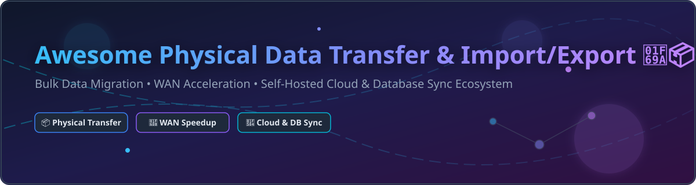

# 🚚 Awesome Physical Data Transfer & Import/Export 📦

  

  
  
  
  
  

---

## ⚡ Top Physical Data Transfer, Bulk Migration & Import/Export Ecosystem 🚀

> **Curated Directory of Enterprise SaaS Appliances & High-Performance Open-Source Projects**
> 
> *Optimized for Petabyte-Scale Physical Mobility, Offline Cloud Migration, WAN Acceleration & Self-Hosted Database Sync Tools.*
>
> 🗓️ **Last updated: October 2026**

---

### 🌐 Overview & Data Mobility Architecture

This repository tracks premier **commercial physical data transfer platforms** and **open-source tools** engineered to move massive enterprise datasets across hybrid cloud infrastructure, data centers, and multi-cloud environments. Solutions range from ruggedized physical transport appliances to UDP-accelerated WAN protocol engines and secure peer-to-peer sync daemons.

- **Enterprise Physical Hardware Leaders**: AWS Snowball, Azure Data Box, Google Cloud Transfer Appliance, Iron Mountain Data Transport.
- **WAN & High-Speed Managed Transfer**: IBM Aspera (FASP), Resilio Connect (ZGT P2P), Signiant Media Shuttle, Datadobi StorageMAP, CTERA Migrate.
- **Universal Open-Source Data Mobility**: Anchored by [rclone](https://github.com/rclone/rclone) for multi-cloud sync, [Syncthing](https://github.com/syncthing/syncthing) for continuous P2P mirroring, [Restic](https://github.com/restic/restic) / [Kopia](https://github.com/kopia/kopia) for encrypted zero-trust backups, and [dbferry](https://github.com/AbdLim/dbferry) for local-first database migration.

---

## 📋 Table of Contents 📌

- [🏢 SaaS & Managed Enterprise Platforms](#-saas--managed-enterprise-platforms)
- [🔓 Open-Source GitHub Projects](#-open-source-github-projects)
- [🤝 How to Contribute](#-how-to-contribute)
- [🔒 Security & Compliance Disclaimer](#-security--compliance-disclaimer)
- [💖 Support & Sponsorship](#-support--sponsorship)
- [📈 Star History](#-star-history)

---

## 🏢 SaaS & Managed Enterprise Platforms 💼

> **Market Insights & Industry Structure**: The global physical data transfer and enterprise bulk migration market is estimated at **~$12.5 Billion**, driven by cloud migration, AI dataset ingestion, and edge computing requirements. The sector is **moderately concentrated** among major hyper-scalers (AWS, Azure, Google Cloud) for physical shipping hardware ("winner-take-most" for respective cloud targets), while WAN acceleration and enterprise storage management remain **fragmented** with specialized software vendors (Aspera, Signiant, Datadobi, CTERA).

| Platform / Product | Description | Company Size (Valuation / Revenue) | Starting Pricing Tier | Free Tier / Trial Limit |
| :--- | :--- | :--- | :--- | :--- |
| **[Microsoft Azure Data Box](https://azure.microsoft.com/en-us/products/databox/)** | 📦 **Microsoft's rugged data transfer appliance** — 100TB capacity in a 45-pound tamper-resistant device for Azure migrations. | **$3.12 Trillion Market Cap** (Microsoft FY2025 Revenue: $245B) | Starts at **$300 per job** (includes 10 days onsite usage; extra days at $15/day). | **No free trial**; service fee waived for select Next-Gen models under managed shipping terms. |
| **[Google Transfer Appliance](https://cloud.google.com/transfer-appliance)** | 🏗️ **Google's rackable storage server** — 100TB (2U) and 480TB (4U) models for large-scale GCP migrations. | **$2.05 Trillion Market Cap** (Alphabet FY2025 Revenue: $350B) | Starts at **$300 base fee** for 40TB unit (includes 15 free onsite days; $30/day thereafter) or **$1,800** for 300TB (25 free days). | **No free trial** available for physical hardware appliances. |
| **[AWS Snowball](https://aws.amazon.com/snowball/)** | ❄️ **AWS's rugged data migration appliance** — 50TB and 80TB devices with 256-bit encryption for petabyte-scale AWS migrations. | **$1.98 Trillion Market Cap** (Amazon FY2025 Revenue: $620B) | Starts at **$300 per job** base service fee (Storage Optimized, includes 10-15 onsite days; $15/day after). | **No free trial** (physical hardware management excluded from AWS Free Tier). |
| **[IBM Aspera](https://www.ibm.com/products/aspera)** | ⚡ **High-speed WAN transfer** — UDP-based FASP protocol for long-distance file transfer and media payloads. | **$210 Billion Market Cap** (IBM FY2025 Revenue: $62B) | Starts at **$250 per TB** on Aspera on Cloud Essentials edition (or Pay-As-You-Go rates). | **14-day free trial** (or up to 50 GB data transfer limit, whichever comes first). |
| **[Iron Mountain Data Transport](https://www.ironmountain.com/)** | 🚛 **Secure physical media transportation** — dedicated vehicles, dual-driver teams, and auditable chain-of-custody. | **$33.5 Billion Market Cap** (Iron Mountain FY2025 Revenue: $6.9B) | Custom transport logistics pricing starting at **~$500 per transport request** depending on route and media volume. | **No free trial**; custom service contracts only. |
| **[Signiant](https://www.signiant.com/)** | 📡 **Managed file transfer for media** — hot folder automation, delivery receipts, and fast broad-scale content delivery. | **~$500 Million Valuation** (Estimated Revenue: ~$45M/year) | Enterprise plans start at **$7,500 per year** for Media Shuttle (based on active users and bandwidth). | **No fixed self-serve trial days**; offers free demo and limited web file sending test option. |
| **[CTERA](https://www.ctera.com/)** | 🗂️ **Global file system and migration platform** — automates file, folder, and permission transfers from legacy NAS. | **~$250 Million Valuation** (Total Funding: $170M; FY2025 Revenue: ~$30M) | Enterprise subscriptions starting at **~$5,000 per year** per gateway instance. | **30-day free trial** (full access to CTERA Portal software environment). |
| **[Datadobi StorageMAP](https://datadobi.com/)** | 🗃️ **Unstructured data migration platform** — full visibility, policy-driven workflows, and auditable chain-of-custody. | **~$50 Million Valuation** (Estimated Revenue: ~$10M/year, bootstrapped) | Enterprise subscriptions start at **~$10,000 per year** (or ~$160,000 for 500TB large-scale migration suites). | **No self-serve free trial**; custom enterprise proof-of-concept (PoC) available upon request. |
| **[Resilio Connect](https://www.resilio.com/)** | 🔄 **Decentralized WAN-optimized file transfer** — peer-to-peer architecture with Zero Gravity Transport protocol. | **Acquired by Nasuni** (Pre-acquisition Revenue: ~$6M/year, Funding: $600K) | Enterprise starting pricing at **$7,500 per year** for server endpoints and multi-site distribution. | **28-day free trial** for enterprise software deployment evaluation. |

---

## 🔓 Open-Source GitHub Projects 🌟

*Repositories are sorted by GitHub Stars_Count (descending). Click the Stars_Badge beside any project to view its stargazers.*

1. **[Syncthing](https://github.com/syncthing/syncthing)**   
   🔄 **Continuous peer-to-peer file synchronization** — decentralized architecture with TLS encryption, cross-platform support, and intuitive web UI. **Best for continuous device-to-device sync without third-party servers**.

2. **[rclone](https://github.com/rclone/rclone)**   
   ☁️ **The universal cloud storage sync tool** — "rsync for cloud storage" supporting 70+ cloud providers (S3, Azure Blob, GCS, OneDrive, Google Drive). Features MD5/SHA-1 verification, timestamp preservation, FUSE mounting, and multi-threaded transfers. **De facto open-source cloud migration tool**.

3. **[restic](https://github.com/restic/restic)**   
   🔐 **Fast, secure, deduplicated backup engine** — cryptography-first design for backing up data to local disks or cloud backends (S3, GCS, Azure). **Best for encrypted zero-trust data movement**.

4. **[Duplicati](https://github.com/duplicati/duplicati)**   
   🛡️ **Free backup client for cloud storage** — stores encrypted, compressed incremental backups on cloud storage providers and remote file servers.

5. **[Kopia](https://github.com/kopia/kopia)**   
   ⚡ **Fast and secure open-source backup tool** — provides end-to-end encryption, client-side deduplication, snapshot management, and CLI/GUI interfaces.

6. **[BorgBackup](https://github.com/borgbackup/borg)**   
   📦 **Deduplicating archiver with compression and encryption** — authenticated encryption, bandwidth throttling, and space-efficient backup migrations.

7. **[rsync](https://github.com/WayneD/rsync)**   
   🛠️ **The foundational file synchronization utility** — famous delta-transfer algorithm minimizing network usage. **The baseline for remote and local file transfers**.

8. **[FreeFileSync](https://github.com/FreeFileSync/FreeFileSync)**   
   📁 **Folder comparison and synchronization tool** — determines differences between source and target folders and transfers minimal differences.

9. **[croc](https://github.com/schollz/croc)**   
   🐊 **Easily and securely transfer files between any two computers** — PAKE peer-to-peer encrypted file transfer over relay servers.

10. **[seaweedfs](https://github.com/seaweedfs/seaweedfs)**   
    🌊 **Fast distributed storage system** — optimized for billions of files, offering high-throughput volume movement and S3 compatibility.

11. **[lsyncd](https://github.com/lsyncd/lsyncd)**   
    ⏱️ **Live Syncing Daemon** — synchronizes local directories with remote targets using inotify and rsync.

12. **[Unison](https://github.com/bcpierce00/unison)**   
    ⚖️ **Bidirectional file synchronization tool** — allows two replicas of a collection of files and directories to be updated independently and reconciled.

13. **[dbferry](https://github.com/AbdLim/dbferry)**   
    🗄️ **Local-first, secure database migration tool** — move schemas and data seamlessly between PostgreSQL, MySQL, SQLite, and MariaDB with row verification and zero external logging.

14. **[transx](https://github.com/cloud-barista/cm-beetle)**   
    🔑 **Encrypted cloud data migration library** — per-field AES keys with RSA key wrapping for secure cloud-to-cloud payload transit.

15. **[RcloneView](https://github.com/rcloneview/rcloneview)**   
    🖥️ **Desktop GUI wrapper for rclone** — manage cloud storage remotes, queue bulk transfers, and view live speed metrics visually.

---

## 🛠️ Frameworks & Custom Architecture Patterns 🧱

When building custom enterprise data mobility solutions:
- **Cloud-to-Cloud / Hybrid**: Combine **rclone** for multi-cloud object storage sync with **restic** / **kopia** for encrypted snapshots.
- **Database Mobility**: Deploy **dbferry** for cross-database schema/data migration or native logical utilities (`pg_dump`, `mysqldump`).
- **Encrypted Pipelines**: Integrate **transx** for zero-trust per-field encryption across public clouds.
- **Continuous Edge Synchronization**: Utilize **Syncthing** or **lsyncd** for automated continuous file distribution.

---

## 🤝 How to Contribute 📝

Contributions from data engineers, cloud architects, and storage maintainers are warmly welcome!

1. 🍴 Fork this repository.
2. ➕ Add or update entries in `README.md` maintaining standard Markdown formatting and accurate links.
3. 📝 Include project name, GitHub link, Stars_Badge, short factual description, and primary use-case.
4. 🚀 Open a Pull Request detailing your changes.

Check out our full collection of curated resources at [Awesome-Awesome-Awesome](https://github.com/ishandutta2007/Awesome-Awesome-Awesome)! ⭐

---

## 🔒 Security & Compliance Disclaimer ⚠️

- This repository is a **community-curated index** provided for informational purposes only.
- **Physical Media Security**: Moving physical hardware (appliances, drives, tapes) requires strict **end-to-end encryption at rest** (e.g., AES-256) and verified tamper-evident logistics.
- **Regulatory Chain-of-Custody**: For HIPAA, GDPR, or SOC2 compliance, ensure auditable shipping logs and signed data sanitization receipts upon transfer completion.
- **WAN Bandwidth Optimization**: Large data transfers over public networks should utilize UDP-accelerated protocols (Aspera FASP, Resilio ZGT) or multi-threaded parallel TCP connections to avoid high latency packet loss.

---

## 💖 Support & Sponsorship 🙏

Thank you for exploring and using this repository! If this curated guide saved you time or helped in your enterprise data migration planning, please consider:
- ⭐ **Starring** this repository on GitHub.
- 🔀 **Forking** and sharing with colleagues and infrastructure teams.
- 💖 Supporting ongoing open-source maintenance via GitHub Sponsors:

---

## 📈 Star History 📊

---

  <b>Built for Cloud Architects, Storage Engineers, and Infrastructure Specialists Seeking Data Transfer Sovereignty.</b>

